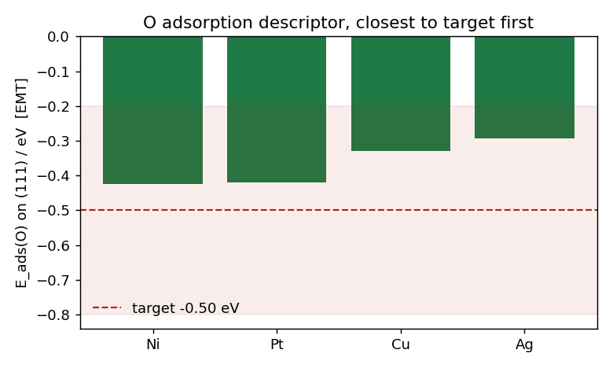

# fcc(111) Oxygen-Adsorption Screen

**Question.** Which fcc(111) metal gives an oxygen adsorption energy closest to the target of **-0.5 eV**?

**Candidate choice.** Selected **Ag, Cu, Pt, and Ni** as a four-metal fcc(111) oxygen-adsorption screen spanning weak to strong expected O binding around the -0.5 eV target. This set gives a compact descriptor sweep across late transition and coinage metals while keeping the surface model fixed: O adsorbed at the fcc hollow site on a 4-layer fcc(111) slab.

## Results

| Metal | a0 (A) | Bulk modulus (GPa) | Site | Layers | E_ads (eV) | Distance from -0.5 eV (eV) | Converged | BFGS steps | Job |
|---|---:|---:|---|---:|---:|---:|---|---:|---:|
| Ag | 4.0637 | 100.1 | fcc | 4 | -0.2925 | 0.2075 | yes | 15 | 1005 |
| Cu | 3.5900 | 133.7 | fcc | 4 | -0.3290 | 0.1710 | yes | 16 | 1006 |
| Pt | 3.9217 | 278.2 | fcc | 4 | -0.4191 | 0.0809 | yes | 19 | 1007 |
| Ni | 3.4863 | 174.9 | fcc | 4 | -0.4245 | 0.0755 | yes | 14 | 1008 |

**Ranking against the -0.5 eV target:** **Ni/Pt tie**, then Cu, then Ag. The 4-layer screen gives a nominal Ni lead over Pt by only 0.0054 eV in target distance, which is not a meaningful separation for this model.

## Best Candidate

The best call is an honest **Ni/Pt tie**. Ni is numerically closest in the 4-layer EMT screen, with E_ads = -0.4245 eV, while Pt is very close at -0.4191 eV. A 6-layer check on Ni gave **E_ads = -0.4239 eV**, converged in 16 BFGS steps, essentially unchanged from the 4-layer value and therefore supporting the conclusion that the Ni/Pt distinction is unresolved rather than a robust lead.

The illustrative lab reference from the surface science group reports **O/Pt(111) E_ads = -0.45 eV** by TPD, which places Pt nearer the -0.5 eV target experimentally than the EMT value does. That reference is not a one-to-one validation of the EMT screening numbers, but it reinforces treating Pt as competitive with Ni.

## Decision and Limitations

Reviewer decision: **approve**; the tie is stated honestly and backed by the 6-layer check.

The main limitation is that **EMT is a toy potential** for this chemistry. The absolute adsorption energies, metal-to-metal separations, and comparison to the TPD reference should not be interpreted as quantitatively predictive. The screen is useful for workflow demonstration and qualitative triage, but a real catalyst decision would require a higher-fidelity electronic-structure method, tighter slab and coverage convergence, consistent gas-phase O reference treatment, and uncertainty estimates large enough to resolve the Ni/Pt near-tie.
