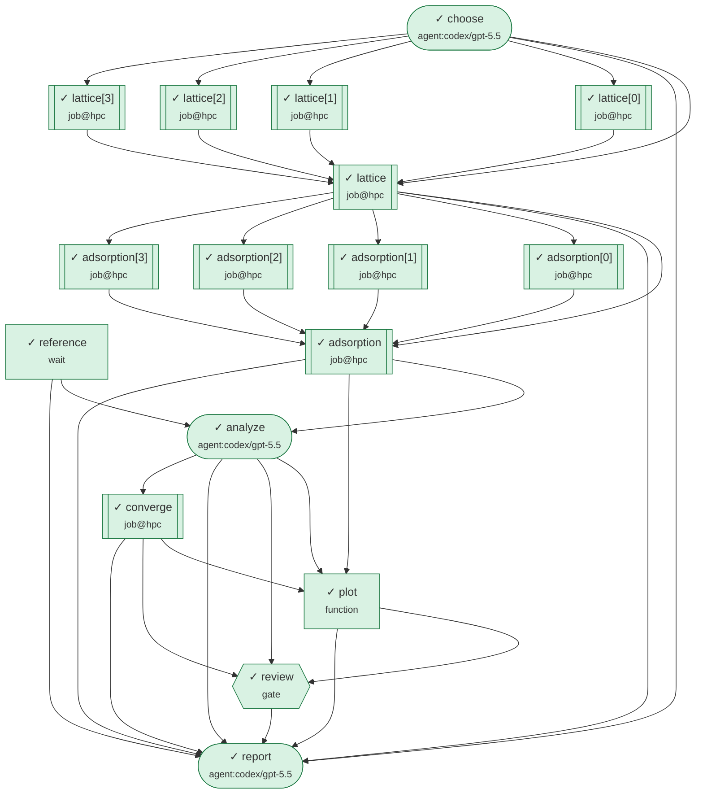

# Screening fcc metals for atomic-oxygen binding (EMT toy model)

**Run** `fcc-catalyst-screening-20261003-060427-8b9b` · **status** `succeeded` · **elapsed** 7m56s · **nodes** 17/17 succeeded

> all nodes finished

## Goal

Which fcc metals bind atomic oxygen closest to a target adsorption energy (a Sabatier-style
descriptor for oxidation catalysis)? An agent chooses and justifies the candidates; Slurm jobs fit
each metal's lattice constant and compute O adsorption on relaxed (111) slabs; a measured reference
value is awaited from the lab; an agent analyses the results and may add a slab-thickness
convergence check; a human reviews the conclusion before the final report is written.
EMT is a toy potential — the point of this example is the workflow, not the chemistry.

**Inputs:** `fakeslurm` = `"/homes/nessa/zhanghao/dev/Eleforge/forgeflow/demo/slurm/bin"`, `n_candidates` = `4`, `python` = `"/homes/nessa/zhanghao/dev/Eleforge/env/bin/python"`, `target_eads` = `-0.5`

## Results

- **report** — Created REPORT.md with the fcc(111) oxygen-adsorption screen, Ni/Pt tie conclusion, convergence check, lab reference, limitations, and embedded descriptor plot.
  - `headline`: "REPORT.md written"
  - file `report`: `nodes/report/a1/work/REPORT.md`
- **plot** — plotted 4 metals; closest to target: Ni
  - `best_by_descriptor`: "Ni"
  - `order`: ["Ni", "Pt", "Cu", "Ag"]
  - `plot`: "/homes/nessa/zhanghao/dev/Eleforge/forgeflow/demo/.forgeflow/runs/fcc-catalyst-screening-20261003-060427-8b9b/descriptor.png"
  - file `plot`: `descriptor.png`


## Workflow



| | node | kind | time | result |
|---|---|---|---|---|
| ✓ | `choose` | agent:codex/gpt-5.5 | 56s | Selected Ag, Cu, Pt, and Ni as a four-metal fcc(111) oxygen-adsorption screen spanning weak to strong expected O binding around the -0.5 eV… |
| ✓ | `reference` | wait | 1m30s | signal 'lab-reference' received from lab:surface-group |
| ✓ | `lattice[0]` | job@hpc | 27s | Ag: a0 = 4.064 Å, B = 100 GPa (EMT) |
| ✓ | `lattice[1]` | job@hpc | 7s | Cu: a0 = 3.590 Å, B = 134 GPa (EMT) |
| ✓ | `lattice[2]` | job@hpc | 27s | Pt: a0 = 3.922 Å, B = 278 GPa (EMT) |
| ✓ | `lattice[3]` | job@hpc | 10s | Ni: a0 = 3.486 Å, B = 175 GPa (EMT) |
| ✓ | `lattice` | job@hpc | 0s | 4/4 item(s) succeeded |
| ✓ | `adsorption[0]` | job@hpc | 6s | O on Ag(111) fcc, 4 layers: E_ads = -0.293 eV |
| ✓ | `adsorption[1]` | job@hpc | 9s | O on Cu(111) fcc, 4 layers: E_ads = -0.329 eV |
| ✓ | `adsorption[2]` | job@hpc | 9s | O on Pt(111) fcc, 4 layers: E_ads = -0.419 eV |
| ✓ | `adsorption[3]` | job@hpc | 10s | O on Ni(111) fcc, 4 layers: E_ads = -0.425 eV |
| ✓ | `adsorption` | job@hpc | 0s | 4/4 item(s) succeeded |
| ✓ | `analyze` | agent:codex/gpt-5.5 | 2m34s | Ranked the 4-layer adsorption results against the -0.5 eV target, used the Ni 6-layer check and Pt lab reference, and found the nominal Ni … |
| ✓ | `converge` | job@hpc | 8s | O on Ni(111) fcc, 6 layers: E_ads = -0.424 eV |
| ✓ | `plot` | function | 2s | plotted 4 metals; closest to target: Ni |
| ✓ | `review` | gate | 11s | approve by tester:claude: Tie stated honestly and backed by the 6-layer check; write it up. |
| ✓ | `report` | agent:codex/gpt-5.5 | 1m28s | Created REPORT.md with the fcc(111) oxygen-adsorption screen, Ni/Pt tie conclusion, convergence check, lab reference, limitations, and embe… |

## Decisions and approvals

- **Plan** approve by `tester:claude` at 2026-10-03T06:04:33 — “end-to-end test of forgeflow; approved by the test operator” (digest `a9cd91a3af1d`)
- **review**: 'revise' by `tester:claude` — “Ni and Pt differ by only ~5 meV in /E_ads - target/. Use the 6-layer convergence result and the lab reference (Pt, -0.45 eV) to say whether the ranking is actually resolved, and state it as a tie if it is not.”
- **review**: 'approve' by `tester:claude` — “Tie stated honestly and backed by the 6-layer check; write it up.”

## How the plan changed

- **am-cc9acdac** proposed by `agent:analyze` — approved → generation 3 by `policy:analyze`
  - why: Insert a 6-layer slab-thickness convergence check for the best 4-layer candidate, Ni, because its advantage over Pt is only 0.0054 eV in distance to target and could plausibly change with slab thickness.
  - detour `converge` (job): 6-layer convergence check
  - re-wired: `plot`, `report`, `review`
- Fan-out: `lattice` → 4 items; `adsorption` → 4 items

## Node details

### ✓ choose — agent:codex/gpt-5.5

*Choose candidate metals*

**attempt 1** — succeeded, 56s
- summary: Selected Ag, Cu, Pt, and Ni as a four-metal fcc(111) oxygen-adsorption screen spanning weak to strong expected O binding around the -0.5 eV target.
- rationale: No calculations were run; the set was chosen from chemical intuition and common trends in O adsorption: Ag provides a weak-binding coinage-metal limit, Cu gives an intermediate coinage-metal case likely closer to mild O binding, Pt is a classic oxidation catalyst and noble-metal benchmark, and Ni provides a stronger-binding late-transition-metal case, making the comparison informative across the available EMT-supported fcc metals.
- agent session `01a1005d-459b-74b1-992c-7b432ced51a8`
- usage: 22221 in / 660 out tokens
- outputs: `{"metals": ["Ag", "Cu", "Pt", "Ni"]}`

### ✓ reference — wait

*Experimental reference value from the lab*

**attempt 1** — succeeded, 1m30s
- summary: signal 'lab-reference' received from lab:surface-group
- outputs: `{"by": "lab:surface-group", "data": {"E_ads_O_Pt111_eV": -0.45, "lab": "surface science group", "method": "TPD (illustrative value)"}, "expired": false, "signal": "lab-reference", "signal_seq": 51}`

### ✓ lattice[0] — job@hpc

*Lattice constant (EOS fit) [0]*

**attempt 1** — succeeded, 27s
- summary: Ag: a0 = 4.064 Å, B = 100 GPa (EMT)
- slurm job `1000` on `hpc` (EXITED), dir `/homes/nessa/zhanghao/dev/Eleforge/forgeflow/demo/.forgeflow/runs/fcc-catalyst-screening-20261003-060427-8b9b/nodes/lattice.0/a1/job`
- outputs: `{"a0": 4.0637, "bulk_modulus_GPa": 100.1, "e_bulk_per_atom": -0.00037, "job_dir": "/homes/nessa/zhanghao/dev/Eleforge/forgeflow/demo/.forgeflow/runs/fcc-catalyst-screening-20261003-060427-8b9b/nodes/lattice.0/a1/job", "job_id": "1000", "metal": "Ag", "summary": "Ag: a0 = 4.064 Å, B = 100 GPa (EMT)"}`

### ✓ lattice[1] — job@hpc

*Lattice constant (EOS fit) [1]*

**attempt 1** — failed, 27s
- slurm job `1001` on `hpc` (EXITED), dir `/homes/nessa/zhanghao/dev/Eleforge/forgeflow/demo/.forgeflow/runs/fcc-catalyst-screening-20261003-060427-8b9b/nodes/lattice.1/a1/job`
- **error** `node_fail`: job 1001: Slurm reports NODE_FAIL (exit 0:9) — a=3.7905 Å  E=0.10792 eV

**attempt 2** — succeeded, 7s
- summary: Cu: a0 = 3.590 Å, B = 134 GPa (EMT)
- slurm job `1004` on `hpc` (EXITED), dir `/homes/nessa/zhanghao/dev/Eleforge/forgeflow/demo/.forgeflow/runs/fcc-catalyst-screening-20261003-060427-8b9b/nodes/lattice.1/a2/job`
- outputs: `{"a0": 3.59, "bulk_modulus_GPa": 133.7, "e_bulk_per_atom": -0.00697, "job_dir": "/homes/nessa/zhanghao/dev/Eleforge/forgeflow/demo/.forgeflow/runs/fcc-catalyst-screening-20261003-060427-8b9b/nodes/lattice.1/a2/job", "job_id": "1004", "metal": "Cu", "summary": "Cu: a0 = 3.590 Å, B = 134 GPa (EMT)"}`

### ✓ lattice[2] — job@hpc

*Lattice constant (EOS fit) [2]*

**attempt 1** — succeeded, 27s
- summary: Pt: a0 = 3.922 Å, B = 278 GPa (EMT)
- slurm job `1002` on `hpc` (EXITED), dir `/homes/nessa/zhanghao/dev/Eleforge/forgeflow/demo/.forgeflow/runs/fcc-catalyst-screening-20261003-060427-8b9b/nodes/lattice.2/a1/job`
- outputs: `{"a0": 3.9217, "bulk_modulus_GPa": 278.2, "e_bulk_per_atom": -0.00018, "job_dir": "/homes/nessa/zhanghao/dev/Eleforge/forgeflow/demo/.forgeflow/runs/fcc-catalyst-screening-20261003-060427-8b9b/nodes/lattice.2/a1/job", "job_id": "1002", "metal": "Pt", "summary": "Pt: a0 = 3.922 Å, B = 278 GPa (EMT)"}`

### ✓ lattice[3] — job@hpc

*Lattice constant (EOS fit) [3]*

**attempt 1** — succeeded, 10s
- summary: Ni: a0 = 3.486 Å, B = 175 GPa (EMT)
- slurm job `1003` on `hpc` (EXITED), dir `/homes/nessa/zhanghao/dev/Eleforge/forgeflow/demo/.forgeflow/runs/fcc-catalyst-screening-20261003-060427-8b9b/nodes/lattice.3/a1/job`
- outputs: `{"a0": 3.4863, "bulk_modulus_GPa": 174.9, "e_bulk_per_atom": -0.01334, "job_dir": "/homes/nessa/zhanghao/dev/Eleforge/forgeflow/demo/.forgeflow/runs/fcc-catalyst-screening-20261003-060427-8b9b/nodes/lattice.3/a1/job", "job_id": "1003", "metal": "Ni", "summary": "Ni: a0 = 3.486 Å, B = 175 GPa (EMT)"}`

### ✓ lattice — job@hpc

*Lattice constant (EOS fit)*

**attempt 1** — succeeded, 0s
- summary: 4/4 item(s) succeeded
- outputs: `{"count": 4, "failed": [], "items": [{"a0": 4.0637, "bulk_modulus_GPa": 100.1, "e_bulk_per_atom": -0.00037, "job_dir": "/homes/nessa/zhanghao/dev/Eleforge/forgeflow/demo/.forgeflow/runs/fcc-catalyst-screening-20261003-060427-8b9b/nodes/lattice.0/a1/job", "job_id": "1000", "metal": "Ag", "summary": "Ag: a0 = 4.064 Å, B = 100 GPa (EMT)"}, {"a0": 3.59, "bulk_modulus_GPa": 133.7, "e_bulk_per_atom": -0.00697, "job_dir": "/homes/nessa/zhanghao/dev/Eleforge/forgeflow/demo/.forgeflow/runs/fcc-catalyst-screening-20261003-060427-8b9b/nodes/lattice.1/a2/job", "job_id": "1004", "metal": "Cu", "summary": …`

### ✓ adsorption[0] — job@hpc

*O adsorption on relaxed (111) [0]*

**attempt 1** — succeeded, 6s
- summary: O on Ag(111) fcc, 4 layers: E_ads = -0.293 eV
- slurm job `1005` on `hpc` (EXITED), dir `/homes/nessa/zhanghao/dev/Eleforge/forgeflow/demo/.forgeflow/runs/fcc-catalyst-screening-20261003-060427-8b9b/nodes/adsorption.0/a1/job`
- outputs: `{"a0": 4.0637, "bfgs_steps": 15, "converged": true, "e_ads": -0.2925, "job_dir": "/homes/nessa/zhanghao/dev/Eleforge/forgeflow/demo/.forgeflow/runs/fcc-catalyst-screening-20261003-060427-8b9b/nodes/adsorption.0/a1/job", "job_id": "1005", "layers": 4, "metal": "Ag", "site": "fcc", "summary": "O on Ag(111) fcc, 4 layers: E_ads = -0.293 eV"}`
- file `structure`: `nodes/adsorption.0/a1/job/final.xyz` (5426 B, sha256 `a846ffff53d7`)

### ✓ adsorption[1] — job@hpc

*O adsorption on relaxed (111) [1]*

**attempt 1** — succeeded, 9s
- summary: O on Cu(111) fcc, 4 layers: E_ads = -0.329 eV
- slurm job `1006` on `hpc` (EXITED), dir `/homes/nessa/zhanghao/dev/Eleforge/forgeflow/demo/.forgeflow/runs/fcc-catalyst-screening-20261003-060427-8b9b/nodes/adsorption.1/a1/job`
- outputs: `{"a0": 3.59, "bfgs_steps": 16, "converged": true, "e_ads": -0.329, "job_dir": "/homes/nessa/zhanghao/dev/Eleforge/forgeflow/demo/.forgeflow/runs/fcc-catalyst-screening-20261003-060427-8b9b/nodes/adsorption.1/a1/job", "job_id": "1006", "layers": 4, "metal": "Cu", "site": "fcc", "summary": "O on Cu(111) fcc, 4 layers: E_ads = -0.329 eV"}`
- file `structure`: `nodes/adsorption.1/a1/job/final.xyz` (5423 B, sha256 `cfb716e19bf9`)

### ✓ adsorption[2] — job@hpc

*O adsorption on relaxed (111) [2]*

**attempt 1** — succeeded, 9s
- summary: O on Pt(111) fcc, 4 layers: E_ads = -0.419 eV
- slurm job `1007` on `hpc` (EXITED), dir `/homes/nessa/zhanghao/dev/Eleforge/forgeflow/demo/.forgeflow/runs/fcc-catalyst-screening-20261003-060427-8b9b/nodes/adsorption.2/a1/job`
- outputs: `{"a0": 3.9217, "bfgs_steps": 19, "converged": true, "e_ads": -0.4191, "job_dir": "/homes/nessa/zhanghao/dev/Eleforge/forgeflow/demo/.forgeflow/runs/fcc-catalyst-screening-20261003-060427-8b9b/nodes/adsorption.2/a1/job", "job_id": "1007", "layers": 4, "metal": "Pt", "site": "fcc", "summary": "O on Pt(111) fcc, 4 layers: E_ads = -0.419 eV"}`
- file `structure`: `nodes/adsorption.2/a1/job/final.xyz` (5417 B, sha256 `ded3fa4c92d2`)

### ✓ adsorption[3] — job@hpc

*O adsorption on relaxed (111) [3]*

**attempt 1** — succeeded, 10s
- summary: O on Ni(111) fcc, 4 layers: E_ads = -0.425 eV
- slurm job `1008` on `hpc` (EXITED), dir `/homes/nessa/zhanghao/dev/Eleforge/forgeflow/demo/.forgeflow/runs/fcc-catalyst-screening-20261003-060427-8b9b/nodes/adsorption.3/a1/job`
- outputs: `{"a0": 3.4863, "bfgs_steps": 14, "converged": true, "e_ads": -0.4245, "job_dir": "/homes/nessa/zhanghao/dev/Eleforge/forgeflow/demo/.forgeflow/runs/fcc-catalyst-screening-20261003-060427-8b9b/nodes/adsorption.3/a1/job", "job_id": "1008", "layers": 4, "metal": "Ni", "site": "fcc", "summary": "O on Ni(111) fcc, 4 layers: E_ads = -0.425 eV"}`
- file `structure`: `nodes/adsorption.3/a1/job/final.xyz` (5423 B, sha256 `cb7deb186c29`)

### ✓ adsorption — job@hpc

*O adsorption on relaxed (111)*

**attempt 1** — succeeded, 0s
- summary: 4/4 item(s) succeeded
- outputs: `{"count": 4, "failed": [], "items": [{"a0": 4.0637, "bfgs_steps": 15, "converged": true, "e_ads": -0.2925, "job_dir": "/homes/nessa/zhanghao/dev/Eleforge/forgeflow/demo/.forgeflow/runs/fcc-catalyst-screening-20261003-060427-8b9b/nodes/adsorption.0/a1/job", "job_id": "1005", "layers": 4, "metal": "Ag", "site": "fcc", "summary": "O on Ag(111) fcc, 4 layers: E_ads = -0.293 eV"}, {"a0": 3.59, "bfgs_steps": 16, "converged": true, "e_ads": -0.329, "job_dir": "/homes/nessa/zhanghao/dev/Eleforge/forgeflow/demo/.forgeflow/runs/fcc-catalyst-screening-20261003-060427-8b9b/nodes/adsorption.1/a1/job", "jo…`

### ✓ analyze — agent:codex/gpt-5.5

*Rank candidates, judge convergence*

**attempt 1** — succeeded, 59s
- summary: Ranked 4-layer fcc(111) O adsorption candidates by distance from the -0.5 eV target and selected Ni as the closest candidate.
- rationale: Absolute deviations from the target are Ni 0.0755 eV, Pt 0.0809 eV, Cu 0.1710 eV, and Ag 0.2075 eV, so Ni is best. A 6-layer check is warranted because Ni and Pt are separated by only 0.0054 eV in target-distance, which is smaller than a typical slab-thickness sensitivity one would want to rule out; the illustrative Pt lab reference (-0.45 eV) is useful context but does not override the EMT ranking. No prior reviewer feedback was provided.
- agent session `01a1005e-f2de-7373-931b-f932d643c801`
- usage: 23341 in / 860 out tokens
- outputs: `{"best": "Ni", "needs_convergence_check": true, "ranking": ["Ni", "Pt", "Cu", "Ag"]}`

**attempt 2** — succeeded, 2m34s
- summary: Ranked the 4-layer adsorption results against the -0.5 eV target, used the Ni 6-layer check and Pt lab reference, and found the nominal Ni lead over Pt is not resolved.
- rationale: 4-layer absolute errors are Ni 0.0755 eV, Pt 0.0809 eV, Cu 0.1710 eV, and Ag 0.2075 eV, so the nominal 4-layer order is Ni, Pt, Cu, Ag. Reviewer feedback is valid: Ni and Pt differ by only 0.0054 eV in target-distance. The existing 6-layer Ni convergence job gives E_ads = -0.4239 eV, only 0.0006 eV different from the 4-layer Ni value, but its target-distance is still 0.0761 eV, only 0.0048 eV better than 4-layer Pt. The lab reference for Pt is -0.45 eV, a 0.0500 eV target-distance, which indicates Pt may be closer under external reference data; because this is an illustrative TPD reference and not a matching EMT slab calculation, I do not promote Pt outright, but the Ni-vs-Pt ranking is not actually resolved. No new amendment is proposed because the requested 6-layer best-candidate slab check has already been run.
- agent session `01a10060-704c-77d2-8ddb-a357996bbbb6`
- usage: 190024 in / 5637 out tokens
- outputs: `{"best": "Ni/Pt tie", "needs_convergence_check": false, "ranking": ["Ni/Pt tie", "Cu", "Ag"]}`

### ✓ converge — job@hpc

*6-layer convergence check*

**attempt 1** — succeeded, 8s
- summary: O on Ni(111) fcc, 6 layers: E_ads = -0.424 eV
- slurm job `1009` on `hpc` (EXITED), dir `/homes/nessa/zhanghao/dev/Eleforge/forgeflow/demo/.forgeflow/runs/fcc-catalyst-screening-20261003-060427-8b9b/nodes/converge/a1/job`
- outputs: `{"a0": 3.4863, "bfgs_steps": 16, "converged": true, "e_ads": -0.4239, "job_dir": "/homes/nessa/zhanghao/dev/Eleforge/forgeflow/demo/.forgeflow/runs/fcc-catalyst-screening-20261003-060427-8b9b/nodes/converge/a1/job", "job_id": "1009", "layers": 6, "metal": "Ni", "site": "fcc", "summary": "O on Ni(111) fcc, 6 layers: E_ads = -0.424 eV"}`

**attempt 2** — succeeded, 8s
- summary: O on Ni(111) fcc, 6 layers: E_ads = -0.424 eV
- slurm job `1010` on `hpc` (EXITED), dir `/homes/nessa/zhanghao/dev/Eleforge/forgeflow/demo/.forgeflow/runs/fcc-catalyst-screening-20261003-060427-8b9b/nodes/converge/a2/job`
- outputs: `{"a0": 3.4863, "bfgs_steps": 16, "converged": true, "e_ads": -0.4239, "job_dir": "/homes/nessa/zhanghao/dev/Eleforge/forgeflow/demo/.forgeflow/runs/fcc-catalyst-screening-20261003-060427-8b9b/nodes/converge/a2/job", "job_id": "1010", "layers": 6, "metal": "Ni", "site": "fcc", "summary": "O on Ni(111) fcc, 6 layers: E_ads = -0.424 eV"}`

### ✓ plot — function

*Descriptor plot*

**attempt 1** — succeeded, 2s
- summary: plotted 4 metals; closest to target: Ni
- outputs: `{"best_by_descriptor": "Ni", "order": ["Ni", "Pt", "Cu", "Ag"], "plot": "/homes/nessa/zhanghao/dev/Eleforge/forgeflow/demo/.forgeflow/runs/fcc-catalyst-screening-20261003-060427-8b9b/nodes/plot/a1/work/descriptor.png", "summary": "plotted 4 metals; closest to target: Ni"}`
- file `plot`: `nodes/plot/a1/work/descriptor.png` (30511 B, sha256 `7ab4f060f5e6`)

**attempt 2** — succeeded, 2s
- summary: plotted 4 metals; closest to target: Ni
- outputs: `{"best_by_descriptor": "Ni", "order": ["Ni", "Pt", "Cu", "Ag"], "plot": "/homes/nessa/zhanghao/dev/Eleforge/forgeflow/demo/.forgeflow/runs/fcc-catalyst-screening-20261003-060427-8b9b/descriptor.png", "summary": "plotted 4 metals; closest to target: Ni"}`
- file `plot`: `descriptor.png` (30511 B, sha256 `7ab4f060f5e6`)

### ✓ review — gate

*Scientist reviews the conclusion*

**attempt 1** — succeeded, 30s
- summary: revise by tester:claude: Ni and Pt differ by only ~5 meV in /E_ads - target/. Use the 6-layer convergence result and the lab reference (Pt, -0.45 eV) to say whether the ranking is actually resolved, and state it as a tie if it is not.
- outputs: `{"by": "tester:claude", "decision": "revise", "text": "Ni and Pt differ by only ~5 meV in |E_ads - target|. Use the 6-layer convergence result and the lab reference (Pt, -0.45 eV) to say whether the ranking is actually resolved, and state it as a tie if it is not."}`

**attempt 2** — succeeded, 11s
- summary: approve by tester:claude: Tie stated honestly and backed by the 6-layer check; write it up.
- outputs: `{"by": "tester:claude", "decision": "approve", "text": "Tie stated honestly and backed by the 6-layer check; write it up."}`

### ✓ report — agent:codex/gpt-5.5

*Write the study report*

**attempt 1** — succeeded, 1m28s
- summary: Created REPORT.md with the fcc(111) oxygen-adsorption screen, Ni/Pt tie conclusion, convergence check, lab reference, limitations, and embedded descriptor plot.
- rationale: Used the supplied 4-layer adsorption and lattice data, incorporated the existing Ni 6-layer convergence output from outputs.json, and followed the reviewer decision to state the Ni/Pt tie honestly because the nominal Ni advantage is only 0.0054 eV.
- agent session `01a10063-1744-7113-83d8-dfc576fb0728`
- usage: 102462 in / 2430 out tokens
- outputs: `{"headline": "REPORT.md written"}`
- file `report`: `nodes/report/a1/work/REPORT.md` (2665 B, sha256 `7c4a52e9f2ac`)

## Timeline

```
06:04:27 +    0s  run created from plan fcc-catalyst-screening by human:zhanghao on frea
06:04:27 +    0s  plan proposed (8 nodes, digest a9cd91a3af1d)
06:04:27 +    0s  decision requested (plan): PLAN  Screening fcc metals for atomic-oxygen binding (EMT toy model)  (fcc-catalyst-scree…
06:04:33 +    6s  decision plan: 'approve' by tester:claude — end-to-end test of forgeflow; approved by the test operator
06:04:33 +    6s  plan APPROVED by tester:claude: end-to-end test of forgeflow; approved by the test operator
06:04:33 +    6s  run started
06:04:33 +    6s  choose#1 started (codex)
06:04:33 +    6s  reference#1 started (wait)
06:04:33 +    6s  reference waiting for signal 'lab-reference'
06:04:34 +    6s  background driver started (pid 13230)
06:05:29 + 1m02s  choose#1 ✓ Selected Ag, Cu, Pt, and Ni as a four-metal fcc(111) oxygen-adsorption screen spanning weak to strong expecte…
06:05:29 + 1m02s  plan change proposed by forgeflow: foreach expansion of lattice over 4 item(s)
06:05:29 + 1m02s  plan change APPLIED → generation 1 by policy:foreach; adds lattice[0], lattice[1], lattice[2], lattice[3]
06:05:29 + 1m02s  lattice[0]#1 started (job)
06:05:29 + 1m02s  lattice[0]#1: submitting to hpc as ff-103f34a0-lattice.0-a1
06:05:29 + 1m02s  lattice[0]#1: slurm job 1000 submitted
06:05:29 + 1m02s  lattice[1]#1 started (job)
06:05:29 + 1m02s  lattice[1]#1: submitting to hpc as ff-103f34a0-lattice.1-a1
06:05:30 + 1m02s  lattice[1]#1: slurm job 1001 submitted
06:05:30 + 1m02s  lattice[2]#1 started (job)
06:05:30 + 1m02s  lattice[2]#1: submitting to hpc as ff-103f34a0-lattice.2-a1
06:05:30 + 1m02s  lattice[2]#1: slurm job 1002 submitted
06:05:35 + 1m08s  lattice[0]#1: job RUNNING (RUNNING)
06:05:35 + 1m08s  lattice[1]#1: job RUNNING (RUNNING)
06:05:35 + 1m08s  lattice[2]#1: job RUNNING (RUNNING)
06:05:56 + 1m29s  lattice[0]#1: job EXITED (COMPLETED)
06:05:56 + 1m29s  lattice[0]#1: job exited (exit code 0, slurm COMPLETED)
06:05:56 + 1m29s  lattice[1]#1: job EXITED (NODE_FAIL)
06:05:56 + 1m29s  lattice[1]#1: job exited (exit code None, slurm NODE_FAIL)
06:05:56 + 1m29s  lattice[2]#1: job EXITED (COMPLETED)
06:05:56 + 1m29s  lattice[2]#1: job exited (exit code 0, slurm COMPLETED)
06:05:56 + 1m29s  lattice[0]#1 ✓ Ag: a0 = 4.064 Å, B = 100 GPa (EMT)
06:05:56 + 1m29s  lattice[1]#1 ✗ node_fail: job 1001: Slurm reports NODE_FAIL (exit 0:9) — a=3.7905 Å  E=0.10792 eV
06:05:56 + 1m29s  lattice[1]: retry scheduled (node_fail: attempt 1/3 failed)
06:05:56 + 1m29s  lattice[2]#1 ✓ Pt: a0 = 3.922 Å, B = 278 GPa (EMT)
06:05:56 + 1m29s  lattice[3]#1 started (job)
06:05:56 + 1m29s  lattice[3]#1: submitting to hpc as ff-103f34a0-lattice.3-a1
06:05:57 + 1m29s  lattice[3]#1: slurm job 1003 submitted
06:05:57 + 1m30s  background driver started (pid 15277)
06:05:59 + 1m32s  lattice[1]#2 started (job)
06:05:59 + 1m32s  lattice[1]#2: submitting to hpc as ff-103f34a0-lattice.1-a2
06:06:00 + 1m32s  lattice[1]#2: slurm job 1004 submitted
06:06:02 + 1m35s  lattice[3]#1: job RUNNING (RUNNING)
06:06:04 + 1m36s  signal 'lab-reference' from lab:surface-group
06:06:04 + 1m36s  reference#1 ✓ signal 'lab-reference' received from lab:surface-group
06:06:07 + 1m39s  lattice[1]#2: job EXITED (COMPLETED)
06:06:07 + 1m39s  lattice[1]#2: job exited (exit code 0, slurm COMPLETED)
06:06:07 + 1m39s  lattice[3]#1: job EXITED (COMPLETED)
06:06:07 + 1m40s  lattice[3]#1: job exited (exit code 0, slurm COMPLETED)
06:06:07 + 1m40s  lattice[1]#2 ✓ Cu: a0 = 3.590 Å, B = 134 GPa (EMT)
06:06:07 + 1m40s  lattice[3]#1 ✓ Ni: a0 = 3.486 Å, B = 175 GPa (EMT)
06:06:07 + 1m40s  lattice: collecting foreach results
06:06:07 + 1m40s  lattice#1 ✓ 4/4 item(s) succeeded
06:06:07 + 1m40s  plan change proposed by forgeflow: foreach expansion of adsorption over 4 item(s)
06:06:07 + 1m40s  plan change APPLIED → generation 2 by policy:foreach; adds adsorption[0], adsorption[1], adsorption[2], adsorption[3]
06:06:07 + 1m40s  adsorption[0]#1 started (job)
06:06:07 + 1m40s  adsorption[0]#1: submitting to hpc as ff-103f34a0-adsorption.0-a1
06:06:07 + 1m40s  adsorption[0]#1: slurm job 1005 submitted
06:06:07 + 1m40s  adsorption[1]#1 started (job)
06:06:07 + 1m40s  adsorption[1]#1: submitting to hpc as ff-103f34a0-adsorption.1-a1
06:06:07 + 1m40s  adsorption[1]#1: slurm job 1006 submitted
06:06:07 + 1m40s  adsorption[2]#1 started (job)
06:06:07 + 1m40s  adsorption[2]#1: submitting to hpc as ff-103f34a0-adsorption.2-a1
06:06:08 + 1m40s  adsorption[2]#1: slurm job 1007 submitted
06:06:13 + 1m46s  adsorption[0]#1: job EXITED (COMPLETED)
06:06:13 + 1m46s  adsorption[0]#1: job exited (exit code 0, slurm COMPLETED)
06:06:13 + 1m46s  adsorption[1]#1: job RUNNING (RUNNING)
06:06:13 + 1m46s  adsorption[2]#1: job RUNNING (RUNNING)
06:06:13 + 1m46s  adsorption[0]#1 ✓ O on Ag(111) fcc, 4 layers: E_ads = -0.293 eV
06:06:13 + 1m46s  adsorption[3]#1 started (job)
06:06:13 + 1m46s  adsorption[3]#1: submitting to hpc as ff-103f34a0-adsorption.3-a1
06:06:13 + 1m46s  adsorption[3]#1: slurm job 1008 submitted
06:06:16 + 1m49s  adsorption[1]#1: job EXITED (COMPLETED)
06:06:16 + 1m49s  adsorption[1]#1: job exited (exit code 0, slurm COMPLETED)
06:06:16 + 1m49s  adsorption[2]#1: job EXITED (COMPLETED)
06:06:16 + 1m49s  adsorption[2]#1: job exited (exit code 0, slurm COMPLETED)
06:06:16 + 1m49s  adsorption[1]#1 ✓ O on Cu(111) fcc, 4 layers: E_ads = -0.329 eV
06:06:16 + 1m49s  adsorption[2]#1 ✓ O on Pt(111) fcc, 4 layers: E_ads = -0.419 eV
06:06:19 + 1m52s  adsorption[3]#1: job RUNNING (RUNNING)
06:06:24 + 1m56s  adsorption[3]#1: job EXITED (COMPLETED)
06:06:24 + 1m56s  adsorption[3]#1: job exited (exit code 0, slurm COMPLETED)
06:06:24 + 1m56s  adsorption[3]#1 ✓ O on Ni(111) fcc, 4 layers: E_ads = -0.425 eV
06:06:24 + 1m56s  adsorption: collecting foreach results
06:06:24 + 1m56s  adsorption#1 ✓ 4/4 item(s) succeeded
06:06:24 + 1m56s  analyze#1 started (codex)
06:07:22 + 2m55s  analyze#1 ✓ Ranked 4-layer fcc(111) O adsorption candidates by distance from the -0.5 eV target and selected Ni as the cl…
06:07:22 + 2m55s  plan change proposed by agent:analyze: Insert a 6-layer slab-thickness convergence check for the best 4-layer candidate, Ni, because its a…
06:07:22 + 2m55s  plan change APPLIED → generation 3 by policy:analyze; adds converge
06:07:22 + 2m55s  converge#1 started (job)
06:07:22 + 2m55s  converge#1: submitting to hpc as ff-103f34a0-converge-a1
06:07:22 + 2m55s  converge#1: slurm job 1009 submitted
06:07:30 + 3m03s  converge#1: job EXITED (COMPLETED)
06:07:30 + 3m03s  converge#1: job exited (exit code 0, slurm COMPLETED)
06:07:30 + 3m03s  converge#1 ✓ O on Ni(111) fcc, 6 layers: E_ads = -0.424 eV
06:07:30 + 3m03s  plot#1 started (function)
06:07:32 + 3m04s  plot#1 ✓ plotted 4 metals; closest to target: Ni
06:07:32 + 3m04s  review#1 started (gate)
06:07:32 + 3m04s  decision requested (node review): Best candidate: Ni (ranking ["Ni", "Pt", "Cu", "Ag"]).
06:07:32 + 3m04s  run parked: gate review#a1 (node)
06:08:01 + 3m34s  decision review#a1: 'revise' by tester:claude — Ni and Pt differ by only ~5 meV in /E_ads - target/. Use the 6-layer convergence result a…
06:08:01 + 3m34s  review#1 ✓ revise by tester:claude: Ni and Pt differ by only ~5 meV in /E_ads - target/. Use the 6-layer convergence res…
06:08:01 + 3m34s  analyze queued to run again: review answered 'revise': Ni and Pt differ by only ~5 meV in /E_ads - target/. Use the 6-layer convergence result and the lab reference (Pt, -0.45 eV) to say whether the ranking is actually resolved, and state it as a tie if it is not.
06:08:01 + 3m34s  converge queued to run again: review answered 'revise': Ni and Pt differ by only ~5 meV in /E_ads - target/. Use the 6-layer convergence result and the lab reference (Pt, -0.45 eV) to say whether the ranking is actually resolved, and state it as a tie if it is not.
06:08:01 + 3m34s  plot queued to run again: review answered 'revise': Ni and Pt differ by only ~5 meV in /E_ads - target/. Use the 6-layer convergence result and the lab reference (Pt, -0.45 eV) to say whether the ranking is actually resolved, and state it as a tie if it is not.
06:08:01 + 3m34s  review queued to run again: review answered 'revise': Ni and Pt differ by only ~5 meV in /E_ads - target/. Use the 6-layer convergence result and the lab reference (Pt, -0.45 eV) to say whether the ranking is actually resolved, and state it as a tie if it is not.
06:08:01 + 3m34s  report queued to run again: review answered 'revise': Ni and Pt differ by only ~5 meV in /E_ads - target/. Use the 6-layer convergence result and the lab reference (Pt, -0.45 eV) to say whether the ranking is actually resolved, and state it as a tie if it is not.
06:08:01 + 3m34s  analyze#2 started (codex)
06:08:01 + 3m34s  run active again (work resumed)
06:10:35 + 6m08s  analyze#2 ✓ Ranked the 4-layer adsorption results against the -0.5 eV target, used the Ni 6-layer check and Pt lab refere…
06:10:35 + 6m08s  converge#2 started (job)
06:10:35 + 6m08s  converge#2: submitting to hpc as ff-103f34a0-converge-a2
06:10:35 + 6m08s  converge#2: slurm job 1010 submitted
06:10:42 + 6m15s  converge#2: job EXITED (COMPLETED)
06:10:42 + 6m15s  converge#2: job exited (exit code 0, slurm COMPLETED)
06:10:42 + 6m15s  converge#2 ✓ O on Ni(111) fcc, 6 layers: E_ads = -0.424 eV
06:10:43 + 6m15s  plot#2 started (function)
06:10:44 + 6m17s  plot#2 ✓ plotted 4 metals; closest to target: Ni
06:10:44 + 6m17s  review#2 started (gate)
06:10:44 + 6m17s  decision requested (node review): Best candidate: Ni/Pt tie (ranking ["Ni/Pt tie", "Cu", "Ag"]).
06:10:44 + 6m17s  run parked: gate review#a2 (node)
06:10:55 + 6m28s  decision review#a2: 'approve' by tester:claude — Tie stated honestly and backed by the 6-layer check; write it up.
06:10:55 + 6m28s  review#2 ✓ approve by tester:claude: Tie stated honestly and backed by the 6-layer check; write it up.
06:10:55 + 6m28s  report#1 started (codex)
06:10:55 + 6m28s  run active again (work resumed)
06:12:23 + 7m56s  report#1 ✓ Created REPORT.md with the fcc(111) oxygen-adsorption screen, Ni/Pt tie conclusion, convergence check, lab re…
06:12:23 + 7m56s  RUN SUCCEEDED: all nodes finished
06:12:23 + 7m56s  background driver stopped (pid 15277)
```

## Provenance

- plan `fcc-catalyst-screening`, base digest `sha256:a9cd91a3af1dde3683aff8c9d62979d32c6504c85fc23dda7e127cbf0fa2a87a`, current generation 3 (`sha256:97b192fd23b9d7d59f17e3b49a9be5e7a8defcb896bf2f52138ff5d9ba1c0178`)
- created 2026-10-03T06:04:27.784Z by `zhanghao` on `frea` with forgeflow 0.1.0
- run directory `/homes/nessa/zhanghao/dev/Eleforge/forgeflow/demo/.forgeflow/runs/fcc-catalyst-screening-20261003-060427-8b9b` — the journal `events.jsonl` is the complete record (148 events)
- report generated by forgeflow 0.1.0
